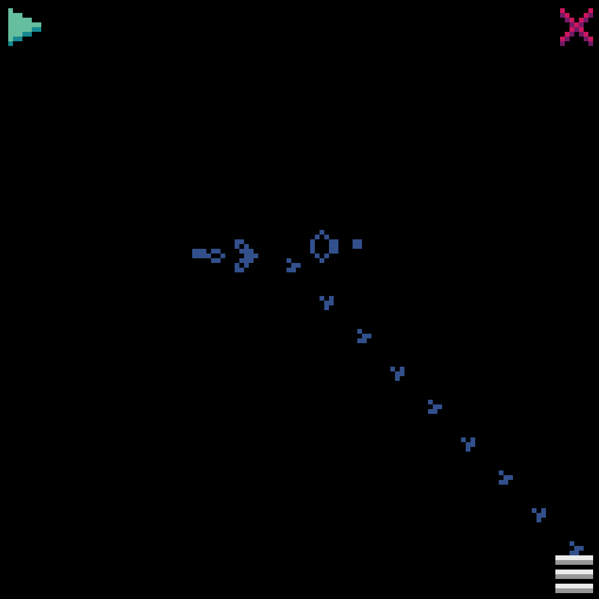

# Conway's Game of Life
[Wikipedia](https://en.wikipedia.org/wiki/Conway%27s_Game_of_Life)

Written in Python using the [Pyxel](https://github.com/kitao/pyxel) library

### [Try it out in your browser](https://kitao.github.io/pyxel/wasm/launcher/?play=AlasdairWallaceMackie.game-of-life.wasm)

## Examples

### Draw pixels on the grid, click Play and see what happens!

### Try out interesting configurations

## To Run
- [Install Pyxel](https://github.com/kitao/pyxel)
- In `game_of_life/` directory, run command: `pyxel run app.py`
